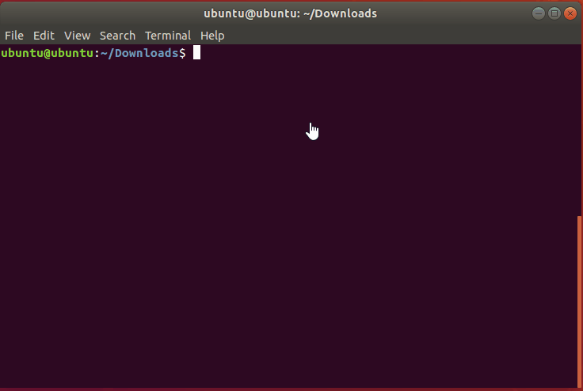
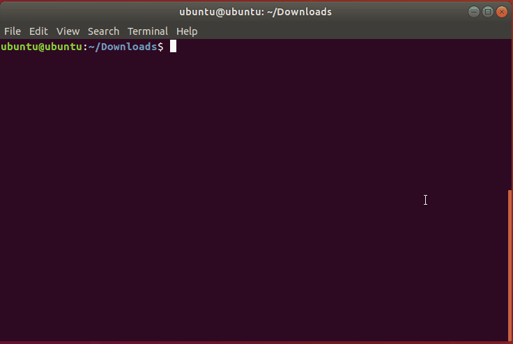

# CodeAssessment

### [Shopping Problem]
```python
import operator

def Solve(N,M,ID,PRICE):
    # not enough coins to buy the cheapest item
    if min(PRICE) > M:
        return [-1]

    table = []
    # create a 2d list to hold corresponding price & id
    for i in range(0, len(PRICE)):
        table.append([PRICE[i], ID[i]])
    
    a = sorted(table, key=operator.itemgetter(1), reverse=True) # sort by ID first
    b = sorted(a, key=operator.itemgetter(0)) # then sort by PRICE as per requirement

    shoppingCart = [] # items to be bought

    for item in b:
        if item[0] > M: # over budget
            break
        else:
            shoppingCart.append(item[1]) # buy item
            M = M - item[0] # update budget

    return sorted(shoppingCart) # return in increasing ID order

if __name__ == "__main__":

    # get input from user
    N,M=map(int,input().split())
    PRICE=[]
    ID=[]
    for _ in range(N):
        x,y=map(int,input().split())
        PRICE.append(x)
        ID.append(y)
    
    # calculate results    
    out_ = Solve(N,M,ID,PRICE)
    
    # print out results
    for i in out_:
        print (i)
```

<p align="center">
  
</p>

### [Character At K]
```python
def PrintList(list_to_print):
    for item in list_to_print:
        print(item)


def Solve(str_list, start, end, index):
    sub_list = [] # holds a list of strings from start to end index
    if start == end:
        sub_list = str_list [start-1]
    else:
        sub_list = str_list[(start-1):end]

    joined_str = str()

    # concat all strings of interest
    for i in sub_list:
        joined_str += i

    char_at_index = joined_str[index-1] # find kth character as per q's
    return char_at_index

if __name__ == "__main__":

    # get input from user
    N = int(input())
    S = []

    for i in range(0, N):
        S.append(str(input()))

    Q = int(input())

    output = [] # results of q's

    for i in range(0, Q):
        L,R,K = map(int, input().split())
        output.append(Solve(S, L, R, K))

    PrintList(output)
```

<p align="center">
  
</p>